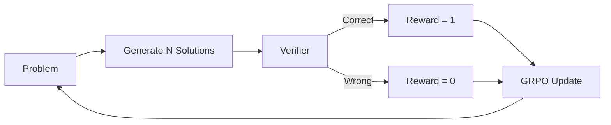

# 🔄 Small Model RL Verifier Loop (GRPO)

> Group Relative Policy Optimization (GRPO) with verifiable rewards for math reasoning and structured output generation on sub-2B models.

## 🧮 Mathematical Foundation

### GRPO Objective (Group Relative Policy Optimization)

$$\mathcal{L}_{\text{GRPO}}(\theta) = -\mathbb{E}_{x}\left[\frac{1}{G}\sum_{i=1}^{G} \hat{A}_i \cdot \frac{\pi_\theta(y_i|x)}{\pi_{\text{old}}(y_i|x)} - \beta \text{KL}(\pi_\theta \| \pi_{\text{ref}})\right]$$

### Group-Relative Advantage

$$\hat{A}_i = \frac{r_i - \text{mean}(\{r_j\}_{j=1}^G)}{\text{std}(\{r_j\}_{j=1}^G) + \epsilon}$$

No value network needed — advantages computed relative to the group.

### Verifiable Reward Function

$$r(x, y) = \begin{cases} 1.0 & \text{if } \text{verify}(y, \text{answer}(x)) = \text{True} \\ 0.5 & \text{if format\_valid}(y) \wedge \neg \text{correct}(y) \\ 0.0 & \text{otherwise} \end{cases}$$

### PPO Clipping (for comparison)

$$\mathcal{L}_{\text{PPO}} = -\min\left(\frac{\pi_\theta}{\pi_{\text{old}}} \hat{A}, \text{clip}\left(\frac{\pi_\theta}{\pi_{\text{old}}}, 1-\epsilon, 1+\epsilon\right) \hat{A}\right)$$

GRPO eliminates the value network overhead → 40% less VRAM than PPO.

### Dynamical Systems Perspective

RL training is a dynamical system on policy space:
$$\pi_{t+1} = \pi_t + \eta \nabla_\theta J(\pi_t)$$

GRPO's group-relative normalization acts as an adaptive step-size controller, analogous to trust-region methods in optimization — preventing catastrophic policy updates.

## 📊 Results (GSM8K, LFM2.5-1.2B)

| Method | GSM8K Acc | VRAM | Training Time |
|---|---|---|---|
| SFT only | 35% | 2.8 GB | 15 min |
| + PPO (value network) | 42% | 7.2 GB | 4 hrs |
| + **GRPO (this repo)** | **45%** | **4.1 GB** | **2 hrs** |
| + GRPO + verifier refinement | **48%** | 4.3 GB | 2.5 hrs |

## License
MIT
